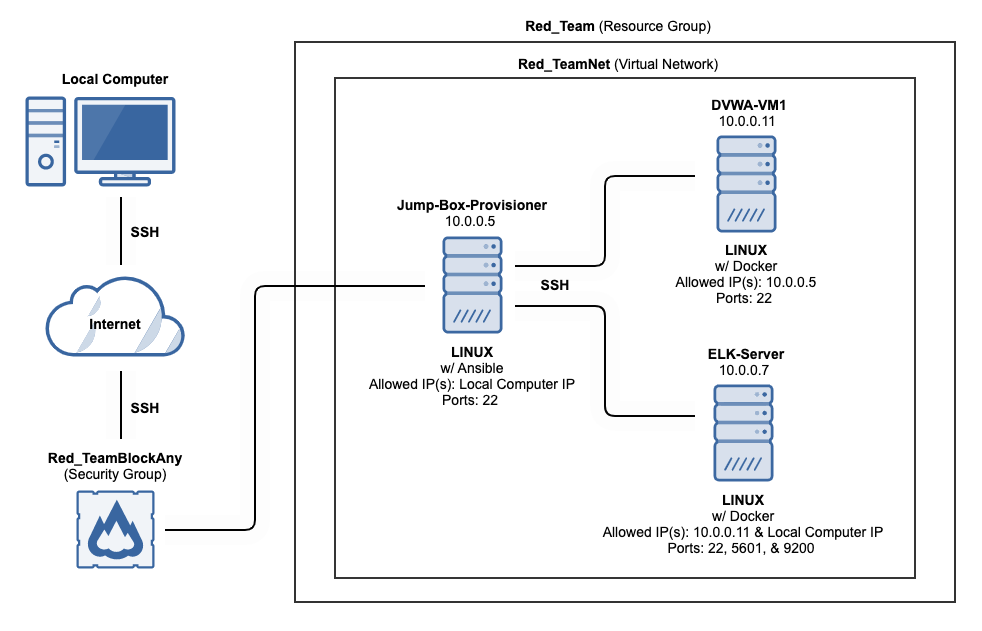

## Automated ELK Stack Deployment

The files in this repository were used to configure the network depicted below.

These files have been tested and used to generate a live ELK deployment on Azure. They can be used to either recreate the entire deployment pictured above. Alternatively, select portions of the filebeat-playbook.yml file may be used to install only certain pieces of it, such as Filebeat.

This document contains the following details:
- Description of the Topology
- Access Policies
- ELK Configuration
  - Beats in Use
  - Machines Being Monitored
- How to Use the Ansible Build

### Description of the Topology

The main purpose of this network is to expose a load-balanced and monitored instance of DVWA, the D*mn Vulnerable Web Application.

Load balancing ensures that the application will be highly available, in addition to restricting and or distributing traffic to the network.

Integrating an ELK server allows users to easily monitor the vulnerable VMs for changes to the log files/data (Filebeat) and system/service metrics (Metricbeat).

The configuration details of each machine may be found below.

| Name                 | Function  | IP Address | Operating System |
|----------------------|-----------|------------|------------------|
| Jump-Box-Provisioner | Gateway   | 10.0.0.5   | Linux            |
| DVWA-VM1             | Container | 10.0.0.11  | Linux            |
| ELK-Server           | Container | 10.0.0.7   | Linux            |

### Access Policies

The machines on the internal network are not exposed to the public Internet. 

Only the Jump-Box-Provisioner machine can accept connections from the Internet. Access to this machine is only allowed from the following IP addresses: *Local Computer IP*

Machines within the network can only be accessed by DVWA-VM1 (10.0.0.11). Technically Jump-Box-Provisioner (10.0.0.5) is allowed as well but mainly DVWA-VM1.

A summary of the access policies in place can be found in the table below.

| Name                 | Publicly Accessible | Allowed IP Addresses          |
|----------------------|---------------------|-------------------------------|
| Jump-Box-Provisioner | No                  | Local Computer IP             |
| DVWA-VM1             | No                  | 10.0.0.5                      |
| ELK-Server           | No                  | Local Computer IP & 10.0.0.11 |

### Elk Configuration

Ansible was used to automate configuration of the ELK machine. No configuration was performed manually, which is advantageous because it speeds up deployment with automation and allows for quick reproduction of environment/applications. In this case it was used to install Docker (as well as other packages specified/needed) and configured the container (ports). Ansible also allows for playbooks to be run on certain or specific machines or groups of machines.

The playbook implements the following tasks:
- Log into Ansible container and update the hosts file (/etc/ansible/) to include the ELK server VM IP under the group elkservers.
- Then create the playbook to configure the elkservers called install-elk.yml in the ansible folder (/etc/ansible/) and make sure to specify elkservers as hosts.
- Task should include memory usage, installation of packages and configuration of port mapping. Once the playbook is created run it and wait for all oks.
- After the playbook runs without errors SSH into the ELK server and run `docker ps` to confirm the sebp/elk container is up/running.
- Lastly whitelist your IP(s) and specify 5601 port so you can access ELK and navigate to Kibana using: http://elkserverip:5601/.

The following screenshot displays the result of running `docker ps` after successfully configuring the ELK instance.

### Target Machines & Beats
This ELK server is configured to monitor the following machines:
10.0.0.11 (DVWA-VM1)

We have installed the following Beats on these machines:
DVWA-VM1 (Filebeats)

These Beats allow us to collect the following information from each machine:
- Filebeats collects syslog data and displays it in a dashboard in this case it is set up for DVWA-VM1.
- Message EX.: INFO Daemon Agent WALinuxAgent-2.2.48.1 launched with command 'python3 -u bin/WALinuxAgent-2.2.48.1-py2.7.egg -run-exthandlers' is successfully running
- `WALinuxAgent` is the Microsoft Azure Linux Agent that manages Linux provisioning and VM interaction with the Azure Controller. It provides a long list of functionalities for Linux IaaS deployments. Something you would expect to see would be for a log to say it was "launched" or "running as the goal state agent". 

### Using the Playbook
In order to use the playbook, you will need to have an Ansible control node already configured. Assuming you have such a control node provisioned: 

SSH into the control node and follow the steps below:
- Copy the filebeat-playbook.yml file to /etc/ansible/ folder.
- Update the hosts file to include the private IP(s) of ELK and Web servers. Put each IP under the specific host group. It is important to match the hosts names specified in the filebeat-playbook.yml (ELK server) and install-elk.yml (Web server).
- Run the playbook, and navigate to Kibana. To get to Kibana you can use http://elkserverip:5601/. Once in Kibana navigate to Logs > System Logs > Check data > System logs dashboard to check that the installation worked as expected.

**Commands to get Filebeat up and running**

1. To download Filebeat run: `curl -L -O https://artifacts.elastic.co/downloads/beats/filebeat/filebeat-7.4.0-amd64.deb`

2. To install run: `dpkg -i filebeat-7.4.0-amd64.deb`

3. To enable and configure the system module run: `filebeat modules enable system`

4. To setup run: `filebeat setup`

5. To start it run: `service filebeat start`